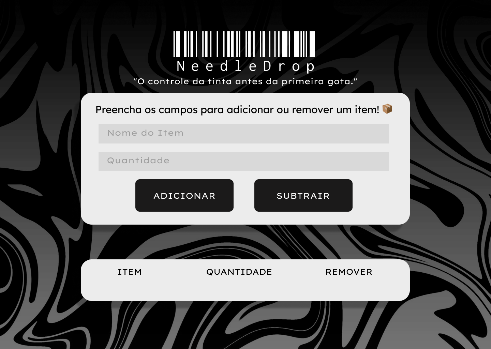

# NeedleDrop 

Aplicativo de controle de estoque voltado para tatuadores.

Projeto em deselvolvimeto como parte da PEX 1 de Análise e Desenvolvimento de Sistemas (Faculdade Descomplica).

##  Status

Em desenvolvimento 🚧

##  Tecnologias previstas

- HTML
- CSS
- JavaScript
- (React, se for usar)
- Firebase / LocalStorage (para dados)

##  Objetivo

Ajudar tatuadores a manterem controle eficiente de materiais como tintas, agulhas e equipamentos, otimizando a gestão do estúdio.

##  Desenvolvido por

[Nathalia Veiga](https://www.linkedin.com/in/nathalia-veiga-14703a101)

##  Protótipo no Figma

Abaixo está a referência visual que estou seguindo para o desenvolvimento da interface do aplicativo NeedleDrop:

🔗 Veja o protótipo no Figma: [Clique aqui](https://www.figma.com/design/BtZZUaWncc7f4laaqRZzGw/NeedleDrop?node-id=0-1&t=vmVYa9a76dw5pKOn-0)
